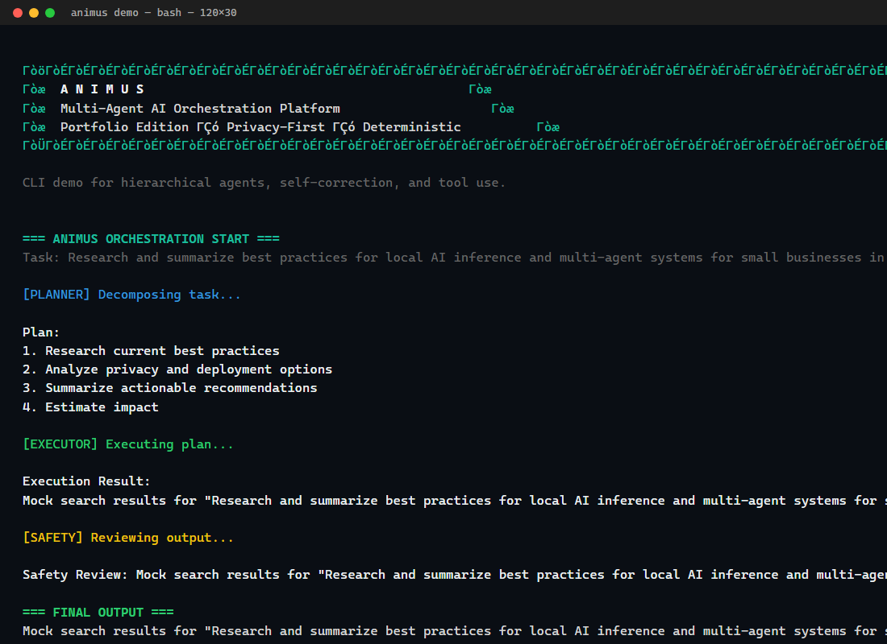
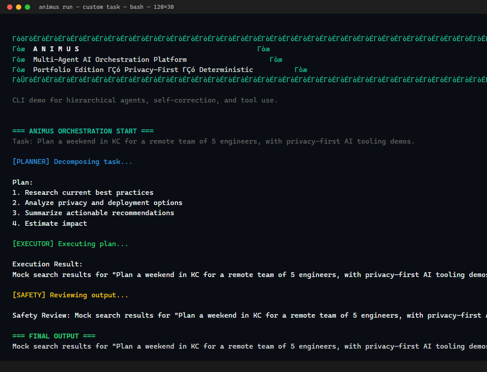

# Animus Portfolio

**Sanitized, public-facing version of Animus** — a multi-agent AI orchestration platform.

> This is a cleaned portfolio edition. The full internal version includes production multi-tenant features, advanced agent squads, and proprietary workflows.

## Screenshots

### `animus demo` — built-in sample task


### `animus run "<custom task>"` — your own task through the pipeline


## Overview

Animus demonstrates reliable agentic systems with:
- **Hierarchical multi-agent teams** (Planner, Executor, Safety/Critic, Memory, etc.)
- **Strict self-correction and validation loops**
- **Tool-calling framework**
- **Beautiful CLI with custom ASCII art banners**
- **Designed for local inference** (Ollama, llama.cpp) and privacy-first deployments

This public version provides a working, self-contained demo of the core orchestration patterns using simulated agents. It is ideal for showcasing agent architecture, prompt engineering discipline, and clean TypeScript/Node CLI development.

## Features

- Polished terminal UX with colored output and ASCII banners
- Interactive demo mode that walks through a full agent workflow
- **Robust error handling** across agents, tools, orchestrator, and CLI
- Extensible agent and tool interfaces
- Example of deterministic execution with review loops
- Documentation and examples ready for extension with real LLMs

## Quick Start

```bash
git clone https://github.com/Nick040791/animus-portfolio.git
cd animus-portfolio
npm install

# Run the interactive demo
npm run demo
```

### Run Tests

```bash
npm test          # Run all tests once
npm run test:watch # Watch mode
npm run test:coverage # With coverage report
```

### With Real LLM Backend (Optional)

1. Install and run Ollama: `ollama serve` and pull a model e.g. `ollama pull qwen2.5`
2. The architecture is designed for easy swapping of the LLM simulation in `src/agents.ts` with real calls.

## Architecture

```
User Task
   |
   v
Orchestrator (with error handling)
   |
   +--> Planner Agent (decomposes task, creates plan)
   |       |
   v       v
Executor Agent (selects & calls tools, performs steps)
   |
   v
Safety / Critic Agent (validates output, suggests corrections)
   |       ^
   |       | (loop if issues)
   +-------+
   |
   v
Final Output + Memory Update
```

**Key Principles**:
- Separation of concerns via specialized agents
- Explicit validation and self-correction
- Tool use with structured schemas
- Observable, deterministic flows for reliability
- Graceful error handling and fallbacks

## Demo Walkthrough

The `npm run demo` command runs a sample task (e.g., "Research and summarize best practices for local AI deployment for SMBs") through the full pipeline, printing each agent's reasoning and actions with nice formatting.

You can also run custom tasks interactively.

**Example Terminal Output** (simplified):

```
╔════════════════════════════════════════════════════════════╗
║  A N I M U S                                           ║
║  Multi-Agent AI Orchestration Platform                    ║
╚════════════════════════════════════════════════════════════╝

=== ANIMUS ORCHESTRATION START ===
Task: Research and summarize best practices for local AI inference...

[PLANNER] Decomposing task...
Plan:
1. Research current best practices
...

[EXECUTOR] Executing plan...
Execution Result: ...

[SAFETY] Reviewing output...
Safety Review: ...

=== FINAL OUTPUT (after self-correction) ===
...
```

## Screenshots & Visual Demo

For the best experience, run `npm run demo` in your terminal to see the full colored output and ASCII banner.

**Recommended**: Capture your own screenshots of the demo running and add them to a `assets/` folder for the README.

Example placeholder for a terminal screenshot:


(Replace with actual screenshot showing colored [PLANNER], [EXECUTOR], [SAFETY] steps and final output.)

## Project Structure

```
animus-portfolio/
├── src/
│   ├── cli.ts          # Entry point and command handling (with error handling)
│   ├── orchestrator.ts # Main coordination logic (with try/catch)
│   ├── agents.ts       # Planner, Executor, Safety (with error handling)
│   ├── tools.ts        # Tool registry and mocks
│   └── types.ts        # Shared interfaces
├── tests/              # Vitest tests
├── .github/workflows/  # CI pipeline
├── package.json
├── tsconfig.json
├── vitest.config.ts
├── README.md
└── .gitignore
```

## Testing & CI

- Tests use **Vitest** for fast TypeScript testing.
- GitHub Actions workflow (`.github/workflows/ci.yml`) runs on every push/PR: installs deps, builds TypeScript, and runs tests.
- All tests currently pass.
- Coverage reports available via `npm run test:coverage`.

## Security

- No hardcoded secrets or API keys.
- User input is trimmed and validated (empty task handling).
- Error handling prevents crashes and provides graceful fallbacks.
- Dependencies are minimal; consider running `npm audit` regularly.
- For production use, add input sanitization and rate limiting as needed.
- GitHub Dependabot is recommended for automated dependency updates (add `.github/dependabot.yml` if desired).

## Extending

- Add real LLM integration (e.g., Ollama or OpenAI-compatible client) in `src/agents.ts`
- Register new tools in `src/tools.ts`
- Create new specialized agents
- Add memory/RAG or persistent state
- Expand tests for new features

## Full Version

The complete Animus platform (private) includes:
- Multi-tenant subscription hosting
- Advanced agent handoff protocols
- Production-grade execution hardening
- Integration with Kanga enterprise workflows
- Custom CLI banners and rich visuals

Contact for demos or collaboration on full deployments.

## License

MIT License

Copyright (c) 2026 Nicholas Beighley / KC Optimal Computing LLC

See LICENSE for details.
